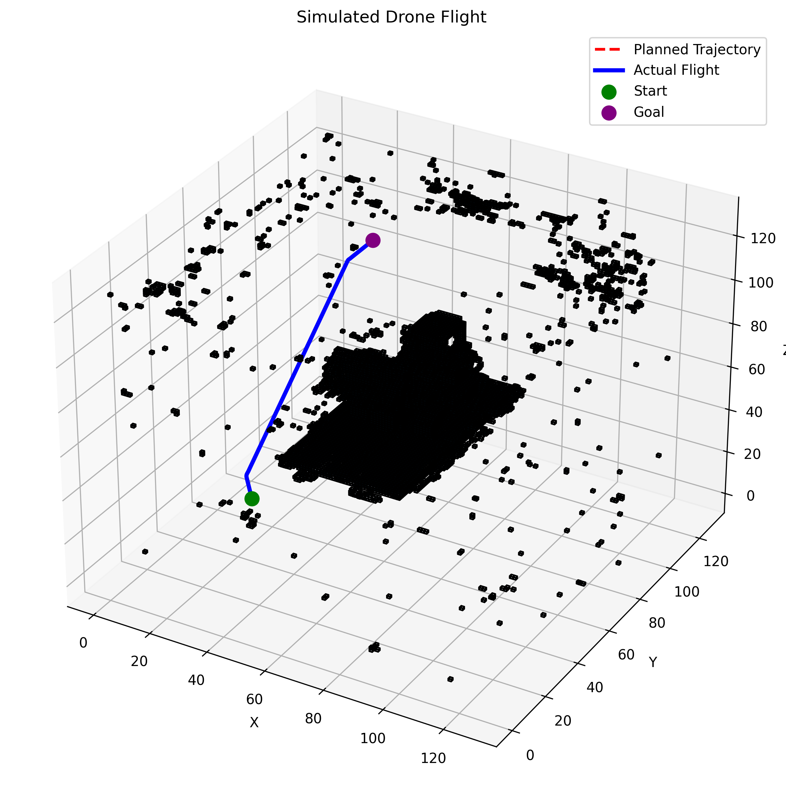

# NeRFNav
An end to end pipeline to control and navigate a drone by visual perception and 3d reconstruction using NeRF.\

# NeRFNav: Autonomous Drone Navigation in Neural Radiance Fields

*(Above: Actual flight trajectory generated by the system. Red Dashed = Planned Path, Blue Solid = Physics-based Drone Flight)*

## 🚀 Overview
**NeRFNav** is a closed-loop autonomous navigation framework that bridges **Neural Rendering (NeRF)** and **Control Theory**.

Unlike standard navigation stacks that rely on LIDAR or pre-built meshes, this system reconstructs a 3D environment directly from 2D RGB images using a custom implementation of **Instant-NGP**. It extracts a volumetric occupancy map, plans a collision-free path, and executes it using a physics-based drone controller.

**Key Achievement:** Implemented a Multi-Resolution Hash Encoding from scratch in PyTorch (without relying on `tiny-cuda-nn`) to achieve reconstruction.

## ✨ Key Features

### 1. Neural Mapping (Custom Instant-NGP)
* **Hash Grid Architecture:** Replaced standard MLPs with a trainable hash table ($\mathcal{O}(1)$ lookup) to capture high-frequency details without exploding memory usage.
* **Memory Optimization:** Implemented a "Chunked Mining" system to extract $128^3$ voxel grids from the implicit neural field without triggering CUDA Out-Of-Memory errors.
* **Trilinear Interpolation:** Custom CUDA-ready implementation of feature interpolation to ensure smooth gradients for backpropagation.

### 2. Planning & Smoothing
* **A* Search:** Rapid pathfinding in 3D voxel space using Euclidean heuristics to navigate complex obstacles.
* **Geometric Smoothing:** Implemented **Chaikin’s Corner Cutting Algorithm** to transform jagged discrete grid paths into $C^1$ continuous B-Splines suitable for agile flight.

### 3. Control & Simulation
* **Physics Engine:** Custom Python simulator modeling drone dynamics ($F=ma$, gravity, drag).
* **PD Controller:** Tuned Proportional-Derivative controller to track spline trajectories with minimal overshoot.

## 🛠️ Tech Stack
* **Core:** Python, PyTorch (CUDA)
* **Math:** NumPy (Vectorized operations), Matplotlib (3D Visualization)
* **Algorithms:** A*, Chaikin Smoothing, Spatial Hashing, Ray Marching

